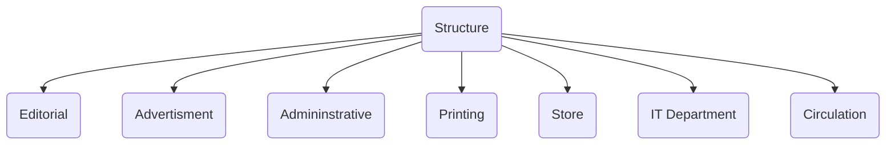

Reporters 
Editing Desk - night editors
Copy Desk
Assignment Desk 

### Functions of news rooms
**- Desktop publishing** 
  layout  
  themes during festivals
  gutter space
**- News gathering**
  - **Reporters** go out and look for news; their specific beat
  - **Correspondents** giving news from other places
**- Selection of news**
  - For example, on business page, if the newshouse has 50 articles, they can't publish all of it.  -> NSE and BSE (stocks) gets the most importance - So selection of news, prioritizing
**- Editing**
  - Word count / article length
  - proofreading
**- Designing**
  - alignment
  - should be able to distinguish bw parts 
  - no overlap 

---

### Gathering news 
- Journalists have sources. Hence the "according to reliable sources"
- many beats; crime, sports, entertainment, etc
- expertise in their specific fields
- field reporters, spot covering, quick gather info that is newsworthy

- submitted to newsrooms

### Editing 
- Proofread
- presentation 
- fixes and makes raw text better
- News selection
- objectivity
- arrange accd to inverted pyramid
- news value
- aren't answerable to reporters
- gatekeeping - filtering news story

--- 

2022-12-01

# Newsroom Structure

Newsroom = central workspace in a media house where editors, news reporters, directors, and producers coming together

aka city room 
team effort, lot of different professionals 

##### Gatekeepers
watchdog
online services don't need gatekeepers usually

### Structure / Elements of newspaper organization
Editorial
IT department 
Advertising 
Circulation
Administrative
Printing Press
Store 

> [!INFO] Exam Info
> Draw the diagram if the structure is asked during examination

#### Advertisment
classified ads
local
national
real estate ads
law ads

display ads

Advertorial (ads + information)

#### Printing Press
- Production aspects
- installation and maintenance of machines
- compiling data -> newspaper format -> paper
- printing plate prep, printing cutting folding

Publisher
Editor                   Page Editor

Managing Editor      Editorial Writers
|
| chief copy editor 

---

Newsroom -> Central part of the news agency

##### News Editors
**Editor** -> Crux of the paper
**Chief Editor** -> similar responsibilities, takes care of everything in absence of editor; 
gutter space, whitespace, no overlap, they don't proofread (no time), decide the title, placement, matches house style
go through all the pages, make sure layout is perf
**Deputy News Editor** -> Which article which page (placement), SELECT most important news
**Sub Editors** -> Proofread; make changes

editorials -> their viewpoints on a current issue / *can be neutral or biased* unlike other articles 

### Reporter's Room
allocated based on beats 
have a deadline

<u>Hierarchy of reporters</u>
Chief Reporter
Senior Reporter (based on experience)
City Reporter (city based reportings; local)
Correspondents (national and international news; even mentioned in byline)
Beats 
[[Columnist]]s
Feature Writers (mostly soft news, lots of pictures; eg. travelogue, light and doesn't make you sad; lengthy, [[Evergreen Content]])

**Editorial Content** 

### Functions of News Bureau
Gathering of information and distribute it 
Local bases, make regional specific changes ! like changing cover page
Beats / specialization based 
Operation of general everyday things (???)
physical desk where reporters can sit and write
Head office (???)

> [!Question] Newsrooms vs News Bureau. What's the difference?
> What's the difference? How are they spread out? One central newsroom and news bureau.

> <small> read also: parachute journalism </small>

_Editor Desk_

**Desk Editor** 

Editors
  |_ senior editors 
  |_ sub editors 
	   |_ proofreaders 
	   |_ journalists
	   |_ reporters  
	   |_ 

format check, page numbers, correct news goes in correct place,
important info is covered
decide deadlines 

last minute changes are incorporated by editor ??

> [!Question] What is the difference between journalist and reporter? 
> one is on field and one writes? Or reporter is field only?

idealogies change over time, due to owners, time, commercialization, change in editors 

