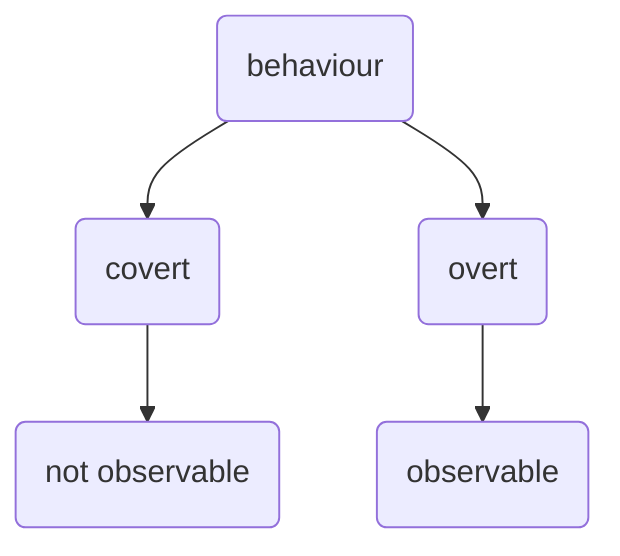

broad definition - *any action of an organism that changes its relationship to its environment. Behavior provides outputs from the organism to the environment.*

Basically, any interaction with the environment; any response, any change;

## Explanations of Behaviour 

1. Biological
2. Physiological
   an activity of the brain or other organs
   hormones, neurotransmitters, 
3. Ontogenetic
    origination and development of an organism (both physical and psychological) usually from the time of fertilization of the egg to adult; 
    lifespan

4. Evolutionary
   lens of evolutionary history 
   remnants of old thingies like getting goosebumps 
   
5. Functional
   How it may have evolved
   genetic drift (accidental)
   helped survive

