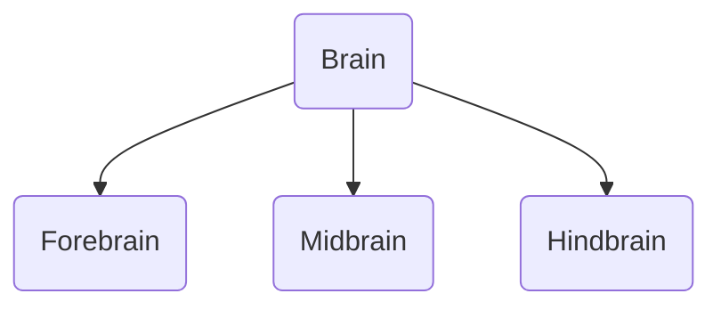

---

tags: ["psychology"]
---

# Brain
Collection of nerves 
60% fat
rest = water, salts, carbohydrates
40% grey matter

3 pounds
bathed in [[Brain#Cerebrospinal Fluid|Cerebrospinal Fluid]]

## Hemispheres of the brain

## Sections of the brain

[[Forebrain]] or prosen cephalon
[[Midbrain]] or mesen cephalon
[[Hindbrain]] or rhomben cephalon

 
> [!mnemonic] **TDM3**
> Divisions of the brain - 
> 1. Telencephalon and Diencephalon
> 2. Mesencephalon 
> 3. Mylencephalon and Metencephalon

## Parts of the Brain

[[Frontal Lobe]]
[[Cerebral Cortex]]
[[Central Sulcus]]
[[Parietal Lobe]]
[[Thalamus]]
[[Hypothalamus]]
[[Occipital Lobe]]
[[Cerebellum]]
[[Medulla Oblongata]]
[[Pons]]
[[Temporal Lobe]]
[[lateral ventrices]]
[[corpus callosum]]

## Cerebrospinal Fluid

Functions - 
1. Shock absorbtion
2. Buoyant and less weight - less physical stress
3. Immunity
4. Nutrition 
5. Waste removal
6. Temperature
