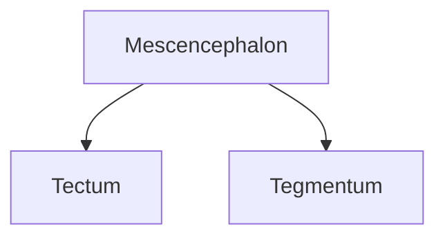

---

tags: ["psychology"]
---

aka mescencephalon

Tectum
Tegmentum 

## Functions 
Motor, esp **eye** and 

vision, hearing, motor control, sleep and wakefulness, arousal (alertness), and temperature regulation