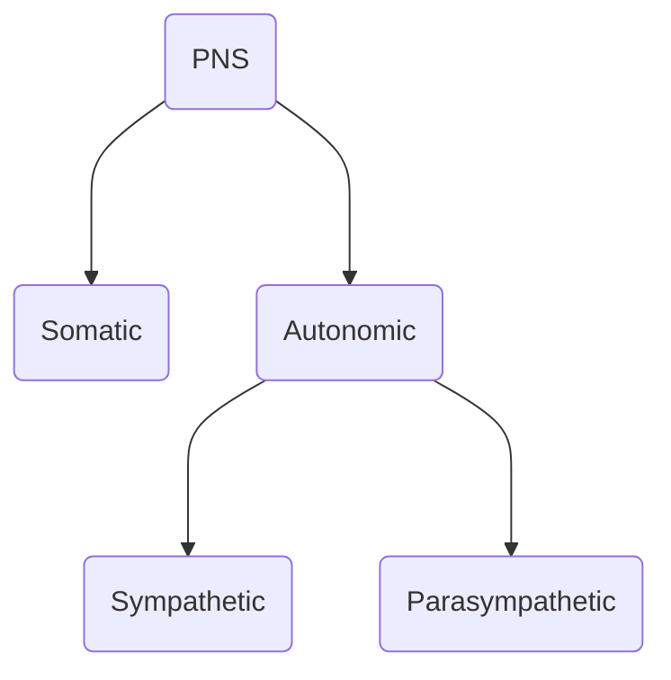

AKA PNS

primary function
is to connect the
brain and spinal cord to
the rest of the body 
transmits information to and from
the [[Central Nervous System]].

```mermaid 
flowchart
A(PNS)--->B(Somatic)
A--->C(Autonomic)
C--->D(Sympathetic)
C--->E(Parasympathetic)
```
